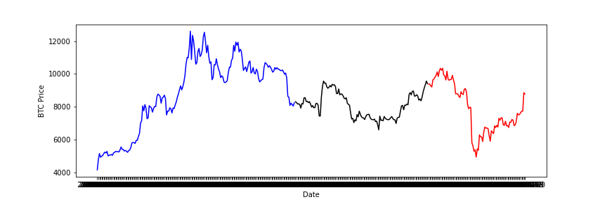

[](http://quantlet.de/)

## [](http://quantlet.de/) **loadcrix** [](http://quantlet.de/)

```yaml

Name of QuantLet : loadcrix

Published in : Valuation and risk management of Cryptocurrency options

Description : 'Load BTC options from a CSV file and plot in multiple colors.'

Keywords : 
- BTC
- Multicolored lines


Author : Jovanka Lili Matic 

Submitted : Sunday, July 11 2020 by Jovanka Lili Matic

Example : 'Load BTC data.'

```

